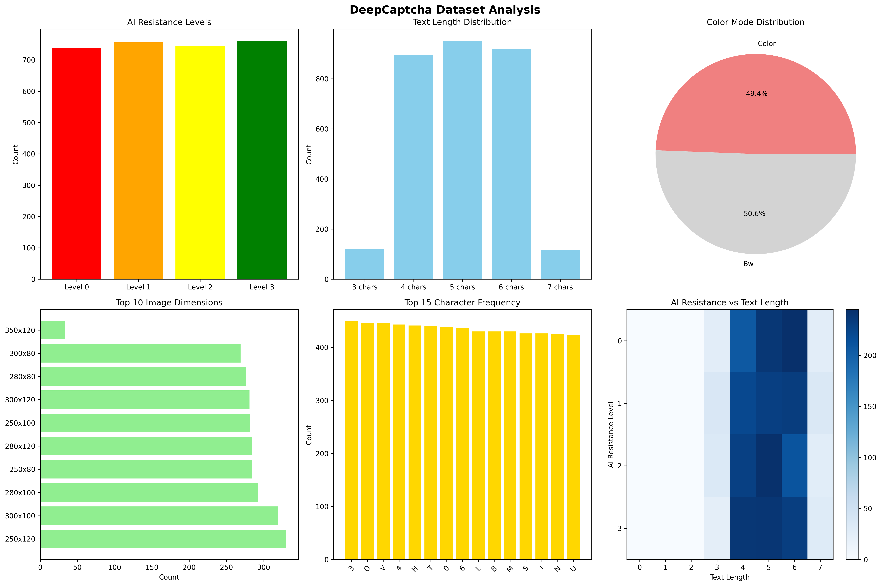

# DeepCaptcha


DeepCaptcha is a Python library for generating CAPTCHA images. It includes features to add noise and distortions that provide resistance against automated recognition (OCR and machine learning models) while remaining readable by humans.

## Features

- **Adjustable Resistance**: Supports different levels of noise and perturbations.
- **Customizable**: Control image dimensions, text length, fonts, and more.
- **Color Support**: Generate both color and grayscale CAPTCHAs.
- **Resource Efficient**: Designed for low-latency generation.

## Installation

```bash
pip install deepcaptcha
```

## Quick Start

```python
from deepcaptcha import DeepCaptcha

# Create a generator instance
gen = DeepCaptcha(ai_resistance_level=1)

# Generate an image and its corresponding text
image, text = gen.generate()

# Save the result
image.save("captcha.png")
print(f"CAPTCHA text: {text}")
```

## Configuration

You can customize the generation process using various parameters:

```python
captcha = DeepCaptcha(
    width=300,
    height=100,
    text_length=5,
    color_mode=True,
    ai_resistance_level=2,
    num_lines=2,
    noise_density=0.5
)
```

## Dataset & Research

This library is supported by extensive research and a large-scale dataset of CAPTCHA images designed to train and test OCR models and other CAPTCHA-breaking algorithms.

### Available Datasets

The **Deep-Captcha** dataset is available on the following platforms:

*   **Hugging Face**: [Deep_Captcha Dataset](https://huggingface.co/datasets/Knight07/Deep_Captcha)
    *   *Description*: A comprehensive collection of generated CAPTCHAs with varying levels of difficulty and noise. Ideal for training robust OCR models.
*   **IEEE DataPort**: [Deep-Captcha Data](https://ieee-dataport.org/documents/deep-captcha)
    *   *Description*: The official dataset release accompanying the research paper. Contains labeled images categorized by complexity.

### Research Visualizations

Our research analyzes the effectiveness of DeepCaptcha against modern recognition systems. Below are key visualizations from our study:

#### Dataset Analysis
Analysis of the dataset distribution and characteristics.


#### Model Performance
Heatmap showing the accuracy of recognition models across different CAPTCHA types and difficulty levels.


#### Character Accuracy
Distribution of recognition accuracy for individual characters, highlighting common confusion pairs.


#### Confidence Reliability
Reliability diagram showing the relationship between model confidence and actual accuracy.


## License

This project is licensed under the MIT License.

## Citation

```bibtex
@software{deepcaptcha2024,
  title={DeepCaptcha: A Python CAPTCHA Library with AI Resistance},
  author={Ayush Shukla},
  year={2026},
  url={https://github.com/kingknight07/Deep-Captcha}
}
```
